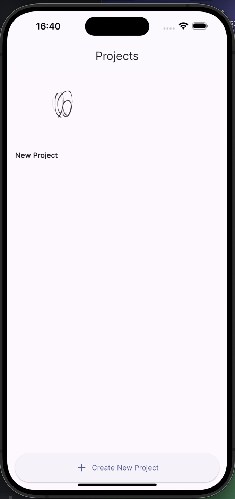
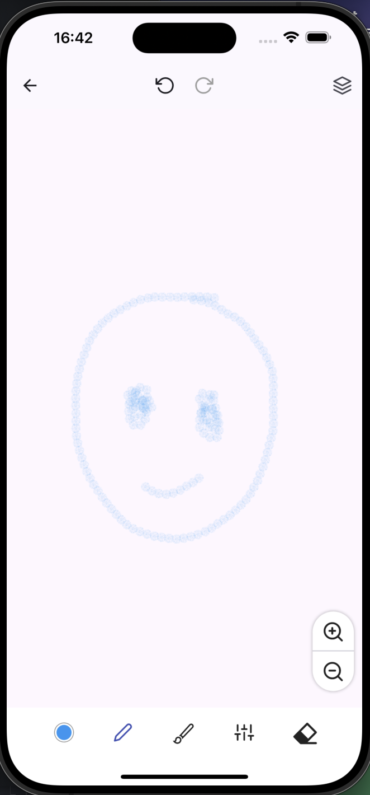
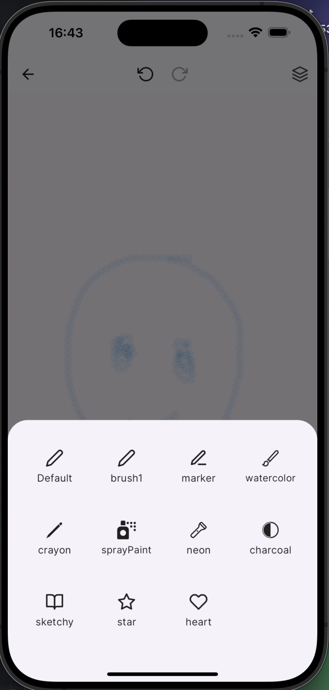
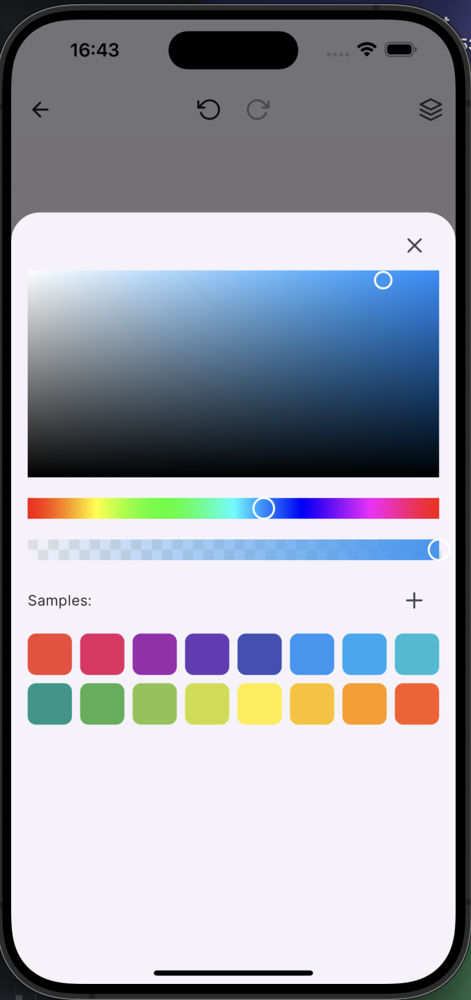

# DoodleVerse

DoodleVerse is a feature-rich digital drawing and painting application built with Flutter. It provides users with a versatile canvas for creating digital art, sketches, and illustrations.

Screenshots
<table>
  <tr>
    <td></td>
    <td></td>
  </tr>
  <tr>
    <td></td>
    <td></td>
  </tr>
</table>

## Features

### Drawing Tools
- Multiple brush types: pencil, marker, watercolor, spray paint, neon, crayon, charcoal, and more
- Customizable brush sizes
- Eraser tool
- Color picker with opacity control

### Layer System
- Support for multiple layers
- Layer visibility toggle
- Layer opacity adjustment
- Layer locking

### Canvas Management
- Zoom in/out functionality
- Pan across the canvas

### Project Management
- Create new projects
- Save and load projects
- Project thumbnail previews

### Undo/Redo
- Undo and redo actions for each layer

### User Interface
- Intuitive bottom toolbar for quick access to tools
- Collapsible side panel for layer management (to be implemented)
- Color picker with recent colors palette

## Project Structure

The project follows a modular structure:

```
lib/
├── app/
│   └── app.dart
├── config/
│   └── assets.dart
├── core/
│   ├── extensions/
│   ├── router/
│   ├── theme/
│   └── utils/
├── data/
│   ├── models/
│   └── storage/
├── l10n/
├── providers/
├── ui/
│   ├── screens/
│   └── widgets/
└── main.dart
```

- `app/`: Contains the main App widget
- `config/`: Configuration files and constants
- `core/`: Core utilities, extensions, and helpers
- `data/`: Data models and storage-related code
- `l10n/`: Localization files
- `providers/`: State management using Riverpod
- `ui/`: User interface components (screens and widgets)

## Key Components

1. **Database**: Uses SQLite (via `sqflite` package) for local storage of projects and layers.

2. **State Management**: Utilizes Riverpod for efficient state management across the app.

3. **Routing**: Implements GoRouter for navigation between screens.

4. **Custom Painting**: Leverages Flutter's `CustomPainter` for drawing functionality.

5. **Asset Management**: Uses a generated `Assets` class for type-safe asset references.

6. **Localization**: Supports multiple languages using Flutter's built-in localization system.

## Development Setup

1. Ensure you have Flutter installed and set up on your machine.
2. Clone the repository:
   ```
   git clone https://github.com/your-username/doodle_verse.git
   ```
3. Navigate to the project directory:
   ```
   cd doodle_verse
   ```
4. Get the dependencies:
   ```
   flutter pub get
   ```
5. Run the app:
   ```
   flutter run
   ```

## Building for Release

To build the app for release, use the following commands:

- For Android:
  ```
  flutter build apk
  ```
- For iOS:
  ```
  flutter build ios
  ```

## Contributing

Contributions to DoodleVerse are welcome! Please feel free to submit pull requests, create issues or spread the word.

## License

[Insert your chosen license here]

## Acknowledgements

- [Flutter](https://flutter.dev/)
- [Riverpod](https://riverpod.dev/)
- [GoRouter](https://pub.dev/packages/go_router)
- [SQLite](https://www.sqlite.org/index.html)

---

For more information on Flutter development, check out the [Flutter documentation](https://docs.flutter.dev/).